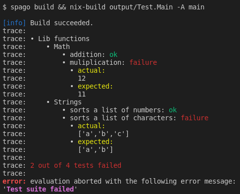

# purescript-miraculix

A testing framework for PureScript's [purenix](https://github.com/purenix-org/purenix) backend. Inspired by Haskell's [tasty](https://github.com/UnkindPartition/tasty) library.


# Docs

- [API Documentation](https://thought2.github.io/purescript-miraculix/Test.Miraculix.html)

# Example

Define some tests like this, e.g. in a `test/Main.purs` file.

```haskell
module Test.Main where

import Prelude
import Test.Miraculix (StorePath, TestTree, runTests, testCase, testGroup, (@?=))
import Data.Array (sort)

main :: StorePath
main = runTests tests

tests :: TestTree
tests =
  testGroup "Lib functions"
    [ testGroup "Math"
        [ testCase "addition" $ 1 + 1 @?= 2
        -- will fail:
        , testCase "muliplication" $ 3 * 4 @?= 11
        ]
    , testGroup "Strings"
        [ testCase "sorts a list of numbers" $ sort [ 2, 3, 1 ] @?= [ 1, 2, 3 ]
        -- will fail:
        , testCase "sorts a list of characters" $ sort [ 'c', 'b', 'a' ] @?= [ 'a', 'b' ]
        ]
    ]
```

## Run tests

```bash
spago build && \
nix-build output/Test.Main/default.nix -A testReport
```

You'll get the following output on the terminal:



If you fix the tests, the derivation can be built. You'll find a report of the successful tests in the `result` symlink. E.g. try `cat result` to display the file.

# Limitations

- Currently running the test suite does not work yet with `spago test`.
- For now the library is specialized on unit tests.
